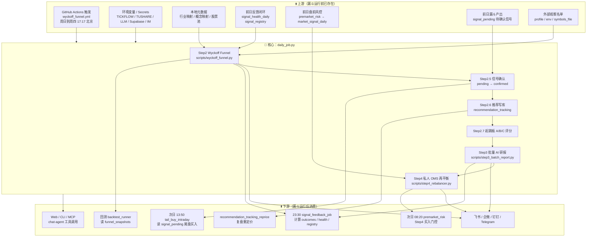
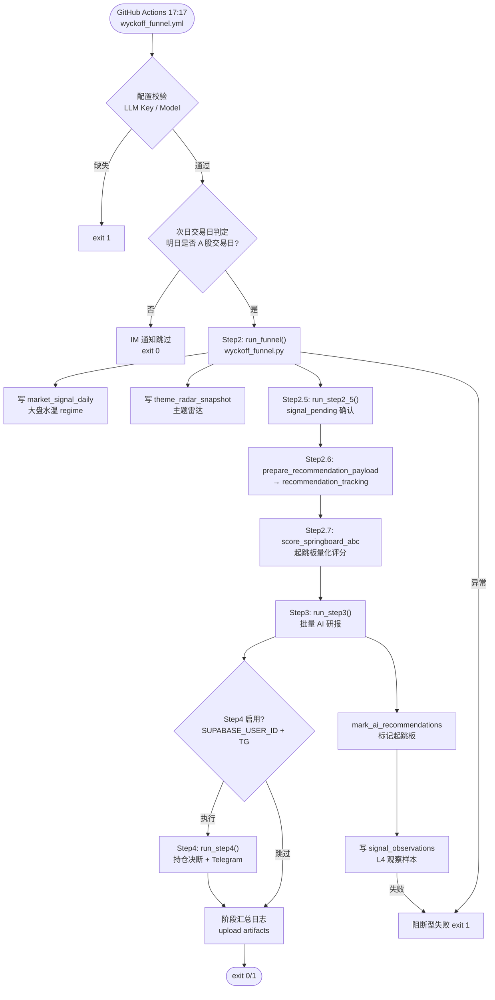
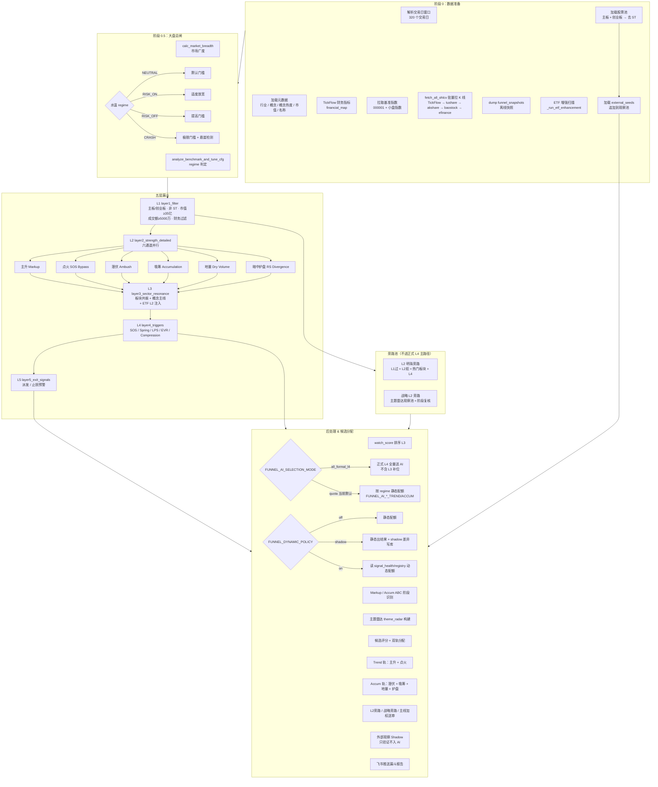
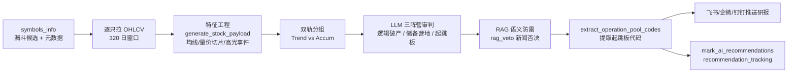
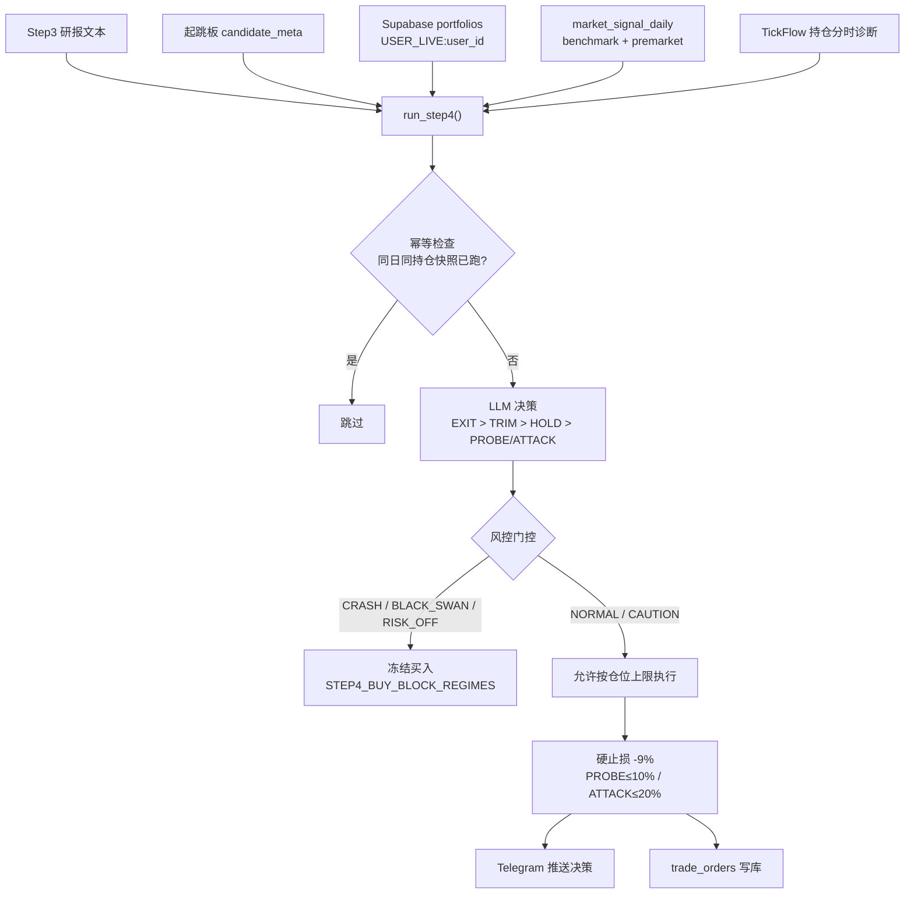
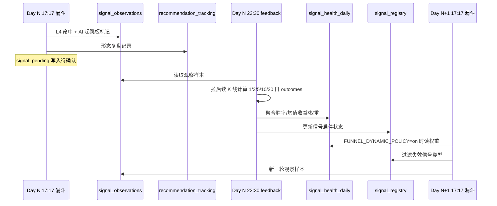
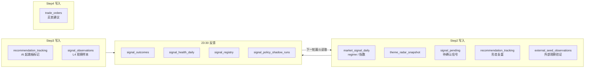

# A 股主漏斗执行流程

> 本文描述 A 股 Wyckoff 主漏斗从 GitHub Actions 触发到 Supabase 写库、跨日反馈闭环的完整执行链路。策略逻辑详见 [`../README_STRATEGY.md`](../README_STRATEGY.md)，架构与数据表详见 [`ARCHITECTURE.md`](ARCHITECTURE.md)。

**主入口**：`.github/workflows/wyckoff_funnel.yml` → `scripts/daily_job.py`（周日到周四 **17:17** 北京时间；仅次日为 A 股交易日时继续）

---

## 一、系统全景：上下游关系



---

## 二、主入口：`daily_job.py` 完整执行链

**触发**：`.github/workflows/wyckoff_funnel.yml` → `python scripts/daily_job.py`



### 阶段与代码映射

| 阶段 | 入口 | 核心模块 |
|------|------|----------|
| 调度 | `wyckoff_funnel.yml` | GitHub Actions |
| 编排 | `scripts/daily_job.py` | 主流程 |
| Step2 | `scripts/wyckoff_funnel.py` | `core/wyckoff_engine.py` |
| Step3 | `scripts/step3_batch_report.py` | `tools/report_builder.py` |
| Step4 | `scripts/step4_rebalancer.py` | `core/strategy.py`（转发） |

---

## 三、Step2 漏斗内部：L0 → L5 详细流程

**核心函数**：`run_funnel_job()` → `core/wyckoff_engine.py`



### L4 触发信号

| 信号 | 含义 | 典型轨道 |
|------|------|----------|
| SOS | 放量突破 | Trend |
| Spring | 假跌破收回 | Accum |
| LPS | 缩量回踩 | Accum |
| EVR | 放量不跌 | Trend |
| Compression | 压缩蓄势 | 通用 |

### 外部观察名单

`external_seeds` 用于把人工关注、社区反馈或其它系统给出的股票加入同一套漏斗观察，而不是作为正式候选来源：

- 配置来源：`config/profiles/a_share_prod.yml`、`FUNNEL_EXTERNAL_SEED_SYMBOLS`、`FUNNEL_EXTRA_SYMBOLS` 或 `symbols_file`
- 默认只做 shadow 观察：记录是否通过 L1/L2、是否在 L2 后触发 L4、是否过期
- 外部观察名单固定为 shadow-only，不进入 `selected_for_ai`
- 通过 L4 的外部观察对象会额外写入 `signal_observations`，`selection_mode=external_seed_shadow`

---

## 四、Step3 AI 研报流程



**LLM 配置**（workflow 默认）：

- Step3：`STEP3_LLM_PROVIDER=gemini`，fallback `efficiency`
- 输入不是原始 K 线，而是压缩后的结构特征

---

## 五、Step4 OMS 持仓决断



---

## 六、跨日反馈闭环

漏斗与 feedback 是**错峰运行**的反馈系统：漏斗先产出观察样本，feedback 盘后验收，下一轮漏斗再读取新的策略状态。详见 [`SIGNAL_FEEDBACK_LOOP.md`](SIGNAL_FEEDBACK_LOOP.md)。



### `FUNNEL_DYNAMIC_POLICY` 模式

| 模式 | 行为 |
|------|------|
| `off` | 默认静态 Trend / Accum 配额，不读取反馈权重 |
| `shadow` | 主流程保持静态配额，动态策略差异写入 `signal_policy_shadow_runs` |
| `on` | 正式使用 `signal_health_daily` 权重和 `signal_registry` 启停状态 |

---

## 七、并行下游任务时间线

| 时间（北京） | 工作流 | 与漏斗关系 |
|-------------|--------|-----------|
| **08:20** | `premarket_risk.yml` | **上游门控**：A50 + VIX → Step4 次日买入权限 |
| **周日-周四 17:17** | `wyckoff_funnel.yml` | **主漏斗** daily_job Step2→3→4；次日非 A 股交易日则跳过 |
| **19:25** | `review_list_replay.yml` | 下游：涨停复盘 |
| **21:10 周五** | `theme_radar.yml` | 下游：主线雷达周报（新闻增强） |
| **23:00 日–四** | `recommendation_tracking_reprice.yml` | 下游：复盘重定价 |
| **23:05** | `db_maintenance.yml` | 下游：清理过期数据 |
| **23:30** | `signal_feedback.yml` | **下游反馈**：刷新 health / registry |
| **次日 13:50** | `tail_buy_1420.yml` | **下游执行**：读 `signal_pending` 尾盘策略；pending 只观察，confirmed 才可 BUY |

---

## 八、Supabase 数据流



---

## 九、数据源降级链（OHLCV）

```
TickFlow (优先, qfq 前复权)
  ↓ 失败
Tushare
  ↓ 失败
AkShare
  ↓ 失败
Baostock
  ↓ 失败
efinance
```

- 批量参数：`BATCH_SIZE=200`，`MAX_WORKERS=4`，320 交易日窗口
- 快照：`data/funnel_snapshots/`（供回测离线使用）

---

## 十、当前生产配置要点

来源：`.github/workflows/wyckoff_funnel.yml`

| 变量 | 当前值 | 作用 |
|------|--------|------|
| `FUNNEL_AI_SELECTION_MODE` | `tradeable_l4` | 只把可交易 L4 结构送入 Step3，减少裸 SOS/EVR 追高噪声 |
| `FUNNEL_AI_TOTAL_CAP` | `8` | AI 总量硬上限；战略/主题补位也受此限制 |
| `FUNNEL_DYNAMIC_POLICY` | `shadow` | 主流程用静态配额，同时记录动态策略差异 |
| `FUNNEL_AI_NEUTRAL_TREND` / `FUNNEL_AI_NEUTRAL_ACCUM` | `2` / `3` | 中性市场保留更多 Accum 槽位给 Spring/LPS/Compression |
| `FUNNEL_EXTERNAL_SEED_SYMBOLS` / `FUNNEL_EXTRA_SYMBOLS` | 空 | 临时追加外部观察名单；存在时自动启用 external seed shadow |
| `STEP4_BUY_HARD_STOP_PCT` | `8.0` | 新开仓硬止损 |
| `STEP4_REQUIRE_CONFIRMED_BUY_CANDIDATE` | `1` | Step4 新开仓只允许二次确认候选；未确认候选只观察 |
| `TAIL_BUY_CONFIRMED_ONLY_BUY` | `1` | 尾盘买入只对二次确认候选输出 BUY |
| `STEP4_BUY_BLOCK_REGIMES` | `CRASH,BLACK_SWAN,RISK_OFF` | 极寒熔断 |

---

## 相关文档

| 文档 | 内容 |
|------|------|
| [`README_STRATEGY.md`](../README_STRATEGY.md) | 策略逻辑、L1–L5 条件、AI 研报与 OMS 规则 |
| [`ARCHITECTURE.md`](ARCHITECTURE.md) | 架构、Actions 全表、Supabase 表结构 |
| [`SIGNAL_FEEDBACK_LOOP.md`](SIGNAL_FEEDBACK_LOOP.md) | 信号反馈闭环详解 |
| [`GLOSSARY.md`](../GLOSSARY.md) | 术语速查 |
