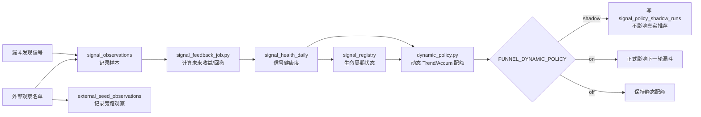
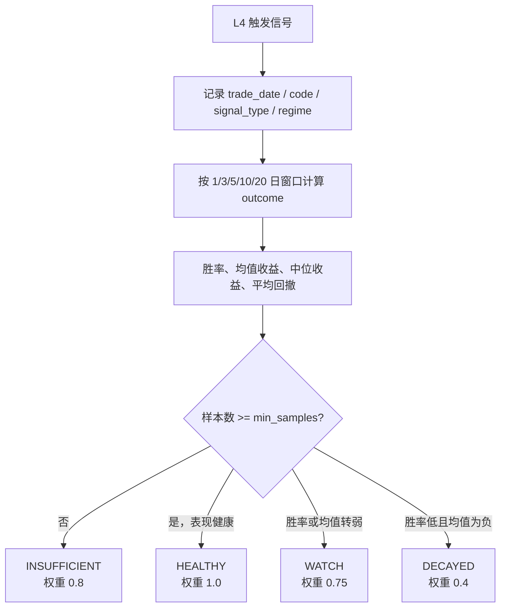
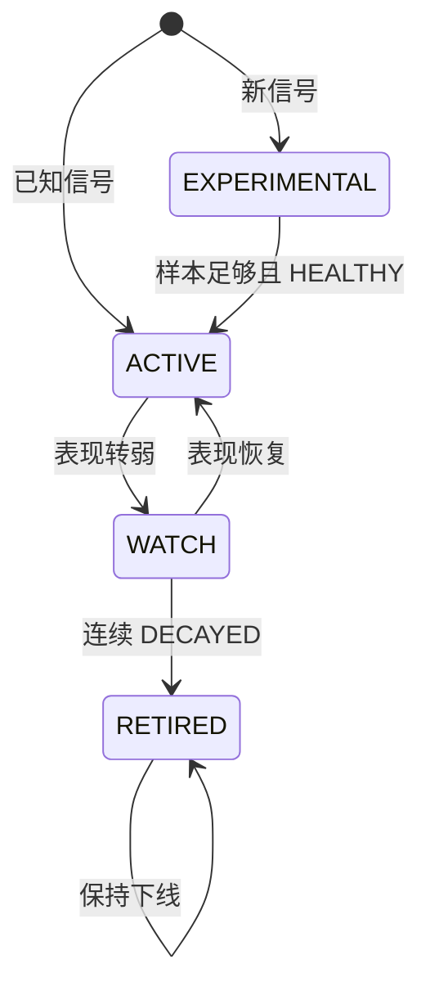
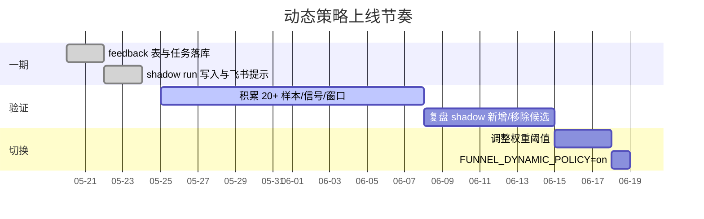

# Wyckoff 系统迭代策略

> 当前阶段：**一期已落地，建议先 shadow 验证**。
> 目标不是让模型“每天换脑袋”，而是让系统长期知道哪些信号正在变强、变弱、该观察还是该退役。

## 总览

## 实现状态

| 方向 | 目标 | 当前实现 | 状态 |
|------|------|----------|------|
| 方向一：信号衰减监控 | 追踪 SOS / Spring / LPS / EVR / Compression 的后续表现 | `signal_observations` 记录样本和 price-action footprint，`signal_outcomes` 计算收益 / 回撤，`signal_health_daily` 聚合健康度 | 已落地一期 |
| 方向二：多策略动态分配 | AI 候选配额从静态规则变为数据驱动 | `dynamic_policy.py` 根据信号权重调整 Trend / Accum 配额，支持 `off` / `shadow` / `on` | 已落地框架，待 shadow 复盘 |
| 方向三：信号生命周期管理 | 新信号孵化、正式上线、观察、退役 | `signal_registry` 维护 `ACTIVE` / `WATCH` / `EXPERIMENTAL` / `RETIRED` | 已落地骨架，阈值待样本校准 |
| 方向四：外部观察验证 | 验证人工/社区/其它系统关注的股票是否真有结构优势 | `external_seed_observations` 记录 L1/L2/L4 位置，L4 确认样本补写 `signal_observations` | 已落地 shadow 观察 |

完整执行链路见 [`SIGNAL_FEEDBACK_LOOP.md`](SIGNAL_FEEDBACK_LOOP.md)。

## 方向一：信号衰减监控

**目标**：按信号类型追踪推荐质量，识别正在失效的信号。

当前口径：
- 按 `signal_type + regime + horizon_days` 聚合，同时生成 `ALL` regime 汇总。
- 默认 registry 判断使用 10 日窗口。
- 样本不足时不贸然退役，只降低权重或保持实验态。
- `features_json.price_action_footprint` 记录承接、缩量、突破质量、派发压力和失败突破标签，用于把“主力痕迹”从主观描述变成可回测特征。

## 方向二：多策略动态分配

**目标**：让 AI 候选配额随信号表现变化，而不是永远固定 Trend / Accum 比例。

当前动态权重来源：

| 来源 | 作用 |
|------|------|
| `signal_health_daily.weight_multiplier` | 信号胜率和收益变差时降低权重。 |
| `signal_registry.status` | `EXPERIMENTAL` / `RETIRED` 信号不参与动态候选。 |
| 市场广度 `breadth.delta_pct` | 广度改善时略偏 Trend，广度走弱时略偏 Accum。 |

运行模式：

| 模式 | 行为 | 用途 |
|------|------|------|
| `off` | 完全使用静态配额 | 默认安全模式 |
| `shadow` | 真实推荐不变，额外记录动态策略会选什么 | 上线前观察 |
| `on` | 动态策略正式影响候选分配 | shadow 稳定后的正式模式 |

Shadow 复盘重点看 `signal_policy_shadow_runs`：
- `diff_added`：动态策略新增的候选。
- `diff_removed`：动态策略移除的静态候选。
- `signal_weights`：触发这次差异的信号权重。
- `registry_snapshot` / `health_snapshot`：当时策略状态快照。

外部观察复盘重点看 `external_seed_observations`：
- `watch_status`：观察对象是被 L1 拒绝、已过 L2、L4 确认，还是只适合继续观察。
- `l4_trigger_tags`：外部观察名单是否真的出现 Spring / SOS / LPS / EVR / Compression。
- `expires_at`：观察有效期，过期后由 maintenance 清理。

## 方向三：信号生命周期管理

**目标**：形成“研究 → 实验 → 正式 → 观察 → 退役”的闭环。

当前实现是保守版：
- 已知信号样本不足时保持 `ACTIVE`，避免冷启动阶段误杀。
- 未知信号样本不足时进入 `EXPERIMENTAL`。
- `WATCH` 后再次 `DECAYED` 才退到 `RETIRED`。

## 上线节奏

建议顺序：
1. 先把 `FUNNEL_DYNAMIC_POLICY` 设为 `shadow`。
2. 连续观察 `signal_policy_shadow_runs`，确认动态策略不是只在追噪声。
3. 用后续收益验证 `diff_added` 是否优于 `diff_removed`。
4. 再切 `on`，并保留回滚到 `shadow` / `off` 的路径。

## 运营检查点

| 看什么 | 表 / 位置 |
|--------|-----------|
| 漏斗本轮记录了多少信号样本 | `signal_observations` |
| outcomes 是否跑完 | `signal_outcomes.status` |
| 哪些信号正在变弱 | `signal_health_daily.health_state` |
| 哪些信号被降级或退役 | `signal_registry.status` |
| shadow 会改变哪些候选 | `signal_policy_shadow_runs.diff_added` / `diff_removed` |
| 飞书是否提示 shadow 写入 | A 股漏斗推送卡片的“动态策略 Shadow”行 |

## 剩余风险

- 当天刚写入的 observation 通常缺少未来 K 线，短周期 outcome 可能先是 `pending`。
- 早期样本少，权重更像“提醒灯”，不适合直接当作强交易信号。
- 不同 regime 下样本会被进一步切薄，`ALL` 汇总和具体 regime 都要看。
- Shadow 优于静态不是看“选得不一样”，而是看 `diff_added` 的后续收益是否长期好于 `diff_removed`。

## Wyckoff 系统的天然优势

Wyckoff 体系属于衰减较慢的一侧：
- 中长期持仓（日线级别），不是毫秒级套利。
- 多因子复合系统：量价结构、阶段、板块、regime 共同确认。
- 自研事件库：Spring / SOS / LPS / EVR / Compression 的识别口径不是公开单因子。

最大风险不是单一信号衰减，而是整套形态识别被更多人复现。动态反馈闭环的意义，就是让系统持续知道哪些信号仍然值得信，哪些信号需要降权、观察或退役。
