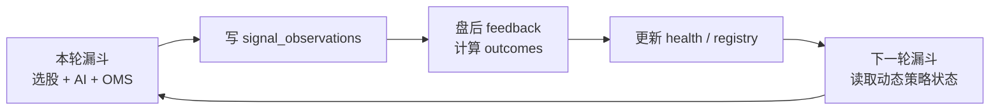
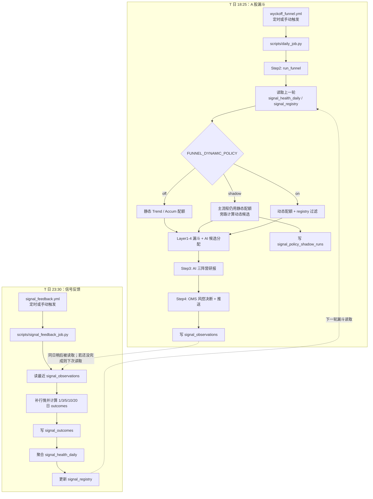
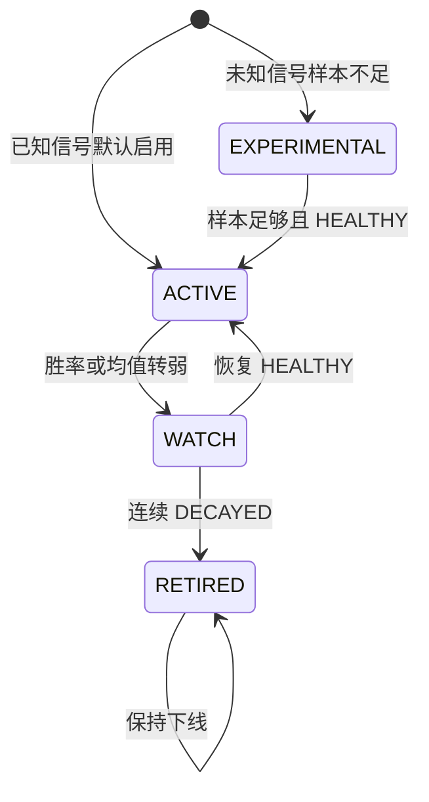
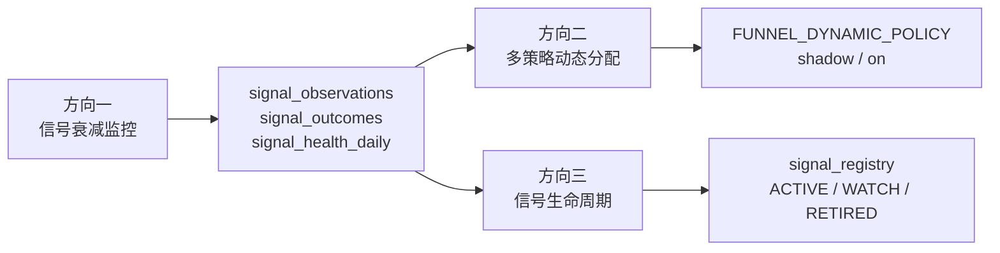

# 信号反馈与动态策略闭环

[← 返回架构文档](ARCHITECTURE.md)

这份文档说明 A 股定时漏斗、信号反馈任务、动态配额和 shadow run 的真实执行关系。它也可以作为 GitHub Wiki 的技术架构页素材。

## 一句话

漏斗负责**发现机会并生产信号样本**，feedback 负责**盘后验收信号表现并更新策略状态**，动态策略在**下一轮漏斗**读取这些状态。默认不是强同步链路，而是错峰运行的反馈闭环。



## 定时流程



## 顺序语义

| 场景 | 结果 |
|------|------|
| 漏斗先完成，feedback 后完成 | 当前推荐路径。feedback 处理本轮写出的 observations，更新下一轮可用的 health / registry。 |
| feedback 先完成，漏斗后完成 | 漏斗会读取已经存在的最新策略状态；漏斗新写的 observations 等下一次 feedback 处理。 |
| 两个任务因手动触发发生重叠 | 不会互相等待，也不会破坏数据；feedback 只处理当时已经落库的 observations，漏掉的样本下一轮补上。 |
| 需要强制串行 | 可以改成 `workflow_run` 或把 feedback 作为漏斗 workflow 的后置 job，但会牺牲独立性。 |

## 动态策略模式

`FUNNEL_DYNAMIC_POLICY` 控制动态策略是否介入漏斗。

| 模式 | 主流程候选 | 额外落库 | 适用阶段 |
|------|------------|----------|----------|
| `off` | 静态配额 | 无 | 默认保守模式 |
| `shadow` | 静态配额 | `signal_policy_shadow_runs` 记录动态配额会选哪些、会换掉哪些 | 观察新策略是否稳定，不影响实盘输出 |
| `on` | 动态配额 + registry 过滤 | observations / outcomes 正常记录 | shadow 结果稳定后切正式 |

GitHub Actions 中建议用 Repository Variables 配置：

| 配置项 | 推荐值 | 说明 |
|--------|--------|------|
| `FUNNEL_DYNAMIC_POLICY` | `shadow` | 非敏感配置，优先放 GitHub Variables；也兼容 Secrets。 |
| `SUPABASE_SERVICE_ROLE_KEY` | service role key | 定时任务写反馈表需要绕过 RLS。 |

本地临时验证：

```bash
FUNNEL_DYNAMIC_POLICY=shadow uv run python scripts/daily_job.py
uv run python scripts/signal_feedback_job.py
```

## 核心数据表

| 表 | 写入方 | 读取方 | 作用 |
|----|--------|--------|------|
| `signal_observations` | 漏斗 `daily_job.py` | feedback job | 记录某日某股票触发了什么 L4 信号，是否进入 AI，是否被 AI 推荐。 |
| `signal_outcomes` | feedback job | feedback job | 记录每个 observation 在 1/3/5/10/20 日后的收益、回撤和完成状态。 |
| `signal_health_daily` | feedback job | 漏斗 | 按 signal / regime / horizon 聚合胜率、平均收益、样本数和权重。 |
| `signal_registry` | feedback job | 漏斗 | 管理信号生命周期：`ACTIVE`、`WATCH`、`EXPERIMENTAL`、`RETIRED`。 |
| `signal_policy_shadow_runs` | 漏斗 shadow 模式 | 人工复盘 | 比较静态策略和动态策略的候选差异。 |

## 信号生命周期



registry 只负责控制动态策略是否使用信号；原始 observations 仍会记录，避免因为下线后失去后续观测能力。

## Shadow 复盘怎么看

Shadow 模式不会影响真实推荐。它的价值是回答三个问题：

1. 动态策略比静态策略多选了哪些股票？
2. 动态策略会移除哪些原本会进 AI 的股票？
3. `diff_added` 的后续收益/回撤是否长期好于 `diff_removed`？
4. 这些差异背后的 `signal_weights` 和 `registry_snapshot` 是否合理？

常用查询：

```sql
select
  trade_date,
  regime,
  base_policy,
  shadow_policy,
  diff_added,
  diff_removed,
  signal_weights
from signal_policy_shadow_runs
order by trade_date desc
limit 10;
```

`strategy_attribution_report.py` 会把 shadow 差异和已有 `signal_outcomes` 关联到
`shadow_diff_stats_json.outcome_stats`。只有当 `diff_added` 在多个周期的收益/回撤稳定好于
`diff_removed`，并且 missing outcome 不高时，才考虑把 `FUNNEL_DYNAMIC_POLICY` 从 `shadow`
切到 `on`。

## 和迭代策略的对应关系



当前一期已经覆盖方向一、方向二的 shadow/on 框架，以及方向三的 registry 骨架。后续主要工作是积累样本、复盘 shadow 差异，并把阈值从经验值迭代成回测验证后的参数。
